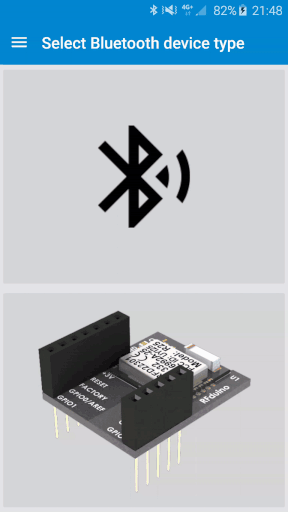

# RFdroid

[](https://travis-ci.org/akinaru/RFdroid)
[](LICENSE.md)

Android app showing Bluetooth advertizing packets and measuring reception rate using one RFduino module



## Build

### Get code source

```
git clone git@github.com:akinaru/RFdroid.git
cd RFdroid
git submodule update --init --recursive
```

### Build Android App

```
./gradlew clean build
```

### Build & Upload RFduino software

```
make
```

refer to https://github.com/akinaru/rfduino-makefile for troubleshoot

## External projects

* BLE AD frame parser : https://github.com/TakahikoKawasaki/nv-bluetooth

* DiscreteSeekbar : https://github.com/AnderWeb/discreteSeekBar

* MPAndroidChart : https://github.com/PhilJay/MPAndroidChart

* Makefile for rfduino : https://github.com/akinaru/rfduino-makefile

* RFduino : https://github.com/RFduino/RFduino

## Useful links

Thanks to Tolson for his Lazarus Library

* http://forum.rfduino.com/index.php?topic=801.0

## License

```
Copyright (C) 2016  Bertrand Martel

This program is free software; you can redistribute it and/or
modify it under the terms of the GNU General Public License
as published by the Free Software Foundation; either version 2
of the License, or (at your option) any later version.

Foobar is distributed in the hope that it will be useful,
but WITHOUT ANY WARRANTY; without even the implied warranty of
MERCHANTABILITY or FITNESS FOR A PARTICULAR PURPOSE.  See the
GNU General Public License for more details.

You should have received a copy of the GNU General Public License
along with Foobar.  If not, see <http://www.gnu.org/licenses/>.
```